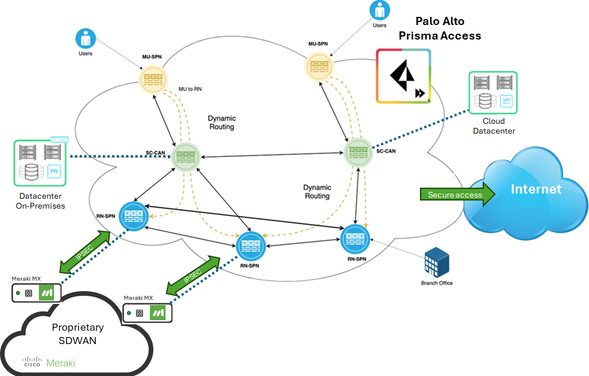
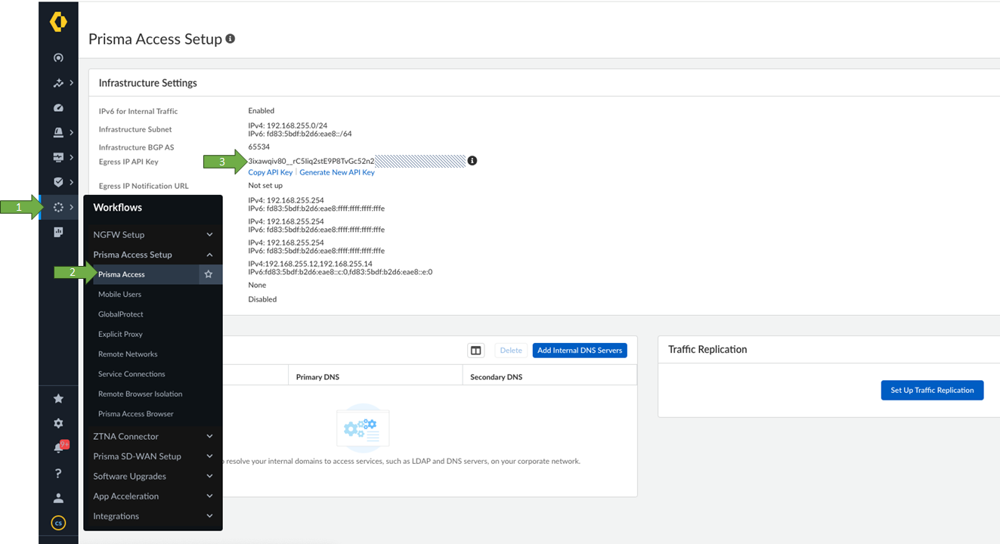
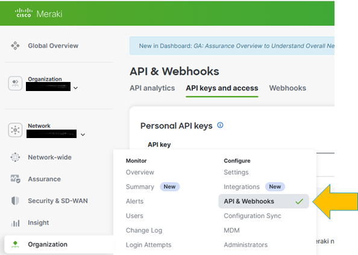
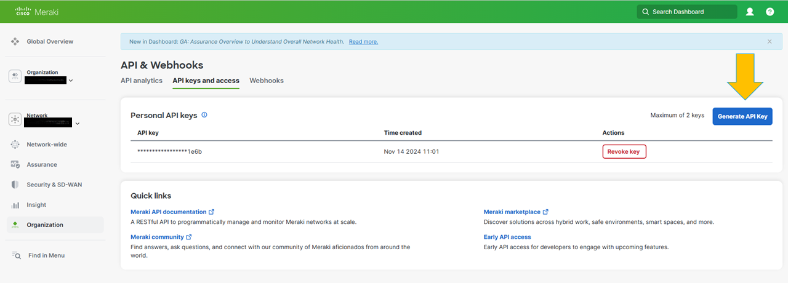
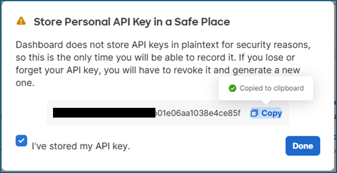
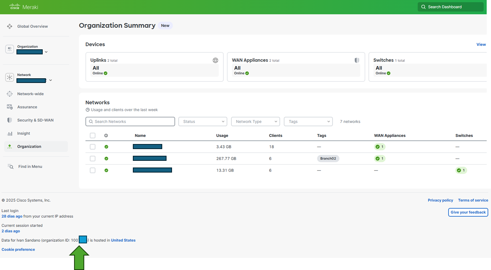

### panw_pa_rn_meraki_integration
Python code to automate the creation of the Palo Alto Prisma Accesss remote network integration with Meraki MX devices

## Overview

Prisma Access provides a flexible way to effectively secure Cisco Meraki SD-WAN deployments. By delivering security from the cloud and closer to the branch networks, Prisma Access lets you optimize networking and security with the same protections that you have at corporate headquarters.

As with other SD-WAN deployments, you secure the Cisco Meraki SD-WAN by onboarding a remote network using IPSec tunnels between the Cisco Meraki SD-WAN and Prisma Access. Using Prisma Access, you can secure SD-WAN devices at a branch, at a data center, or both. You can onboard a remote network using IPSec tunnels between the Cisco Meraki SD-WAN device and Prisma Access automatically using this scripts. See the product requirements below for eligible devices that support this automation. 

## Why connecting our Meraki devices to PANW Prisma Access

Integrating a Cisco Meraki MX device with Palo Alto Networks Prisma Access can provide a powerful combination of branch-level connectivity with best in class cloud-delivered security. Here’s why organizations might choose to do this:

A) Enhanced Security 

Meraki MX provide a legacy SD-WAN and very basic security (like stateful firewall, content filtering, and IPS). But Prisma Access offers best in class, enterprise-grade, next-gen security capabilities, such as:

1. Advanced Threat Prevention (ATP)
2. Cloud-based URL filtering with real-time updates
3. Data Loss Prevention (DLP)
4. Zero Trust Network Access (ZTNA)

So, traffic from Meraki MX can be routed to Prisma Access for deep inspection and policy enforcement.

B) Cloud-Native Security for Remote and Branch Users

Meraki MX handles local connectivity and routing, but by integrating it with Prisma Access:

1. Remote branches gain access to a consistent cloud-based security layer
2. You get uniform security policies across distributed sites and mobile users
This centralizes security management and compliance.

C) Scalability and Flexibility
Prisma Access is built for scale — it's hosted in the cloud, so:
1. There's no need to deploy hardware firewalls at every site
2. You can easily onboard new branches using Meraki MX and point them to Prisma Access
3. It supports dynamic scaling as your traffic or user base grows

D) Hybrid and Secure SD-WAN
Meraki MX can still establish SD-WAN tunnels to multiple destinations and include VPN tunnels to no Meraki peers, like Prisma Access. You can configure:

IPSec tunnels from Meraki MX to Prisma Access
Dual/multi-path routing with failover and load balancing
Site-to-site VPN to Prisma Access for secure transport to the cloud

This enables a hybrid WAN architecture that combines performance optimization and security.

E) Centralized Visibility, Management and Automation
Prisma Access GUI offers centralized logging, reporting, and security policy enforcement — complementing the Meraki Dashboard which provides network-level monitoring.
Also, both solutions provide secure API's to automate the deployment and parameters updates.

## Requirements

Palo Alto Prisma Access:
1) Update your Prisma Access to version 2.1 Preferred or a later version.
2) Migrate remote networks to the aggregate bandwidth model.
3) Activate bandwidth license per compute location.

Cisco Meraki
1) Physical Cisco Meraki (MX or Z) devices with a minimum version of 15.12 in Cisco Meraki Hub or Spoke networks.
2) Cisco Meraki devices should be in Appliance or Combined type networks
3) Cisco Meraki networks that have enabled the VPN Mode in the Site-to-Site VPN configurations

## How to Use

1. Clone repository with `git clone https://github.com/ibrugnolli/pa_egress_ip_addresses`
2. Change directory to `pa_egress_ip_addresses`
3. Edit `pa_env.py`
* Update the variable `X_PAN_KEY`, with the Egress Public IP Addresses API Key.
* Example: `X_PAN_KEY = "_your_api_key__"`

* Update the variable `meraki_api_key`, with the Meraki Dashboard API key.
* Example: `meraki_api_key = "_your_api_key__"`

* Update the variable `meraki_org_id`, with the Meraki Dashboard Organization ID.
* Example: `meraki_org_id = "_your_org_id__"`

